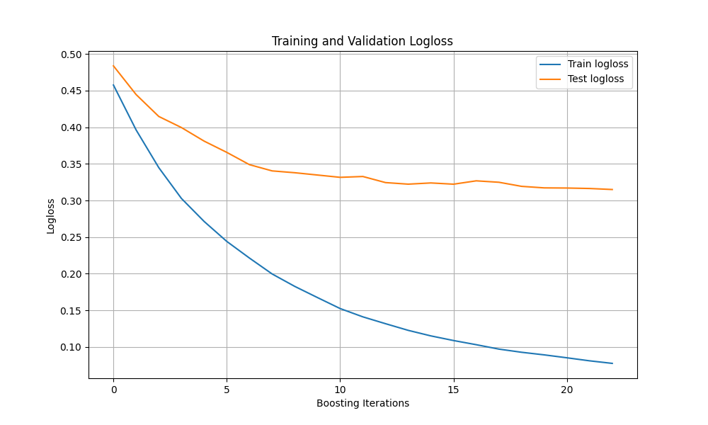
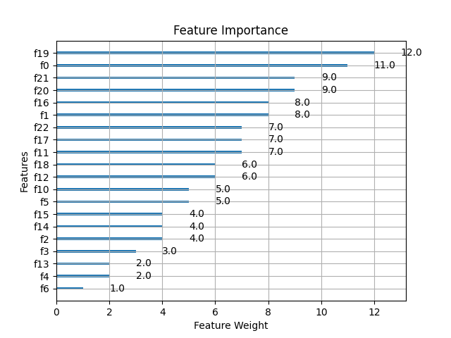
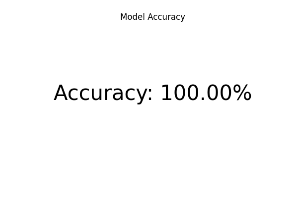

# Parkinson's Disease Detection Using XGBoost

## Описание проекта | Project Description

Это учебный проект, посвященный прогнозированию заболевания Паркинсона на ранней стадии с использованием алгоритма машинного обучения XGBoost. Проект направлен на изучение и применение методов обработки данных, нормализации признаков и разработки моделей машинного обучения на реальных данных.

This is an educational project focused on predicting Parkinson's disease at an early stage using the XGBoost machine learning algorithm. The project aims to study and apply data preprocessing methods, feature normalization, and machine learning model development on real-world data.

## Датасет | Data Set

**Источник | Source**: Датасет был создан Максом Литтлом из Оксфордского университета в сотрудничестве с Национальным центром голоса и речи, Денвер, Колорадо, который записал голосовые сигналы. Данные содержат измерения голоса 31 человека, 23 из которых страдают болезнью Паркинсона.

The dataset was created by Max Little of the University of Oxford in collaboration with the National Centre for Voice and Speech, Denver, Colorado, who recorded the voice signals. The data contains voice measurements from 31 people, 23 of whom have Parkinson's disease.

### Характеристики | Characteristics

- **Тип задачи | Task Type**: Классификация | Classification
- **Число экземпляров | Number of Instances**: 197
- **Число атрибутов | Number of Attributes**: 23
- **Тип данных | Data Type**: Многомерный | Multivariate
- **Пропущенные значения | Missing Values**: Отсутствуют | None
- **Цель данных | Data Goal**: Различение здоровых людей и больных Паркинсоном по столбцу "status", который равен 0 для здоровых и 1 для больных.

To distinguish between healthy people and those with Parkinson's disease using the "status" column, where 0 indicates healthy and 1 indicates Parkinson's disease.

### Атрибуты | Attributes

- **name**: Имя субъекта и номер записи | ASCII subject name and recording number
- **MDVP:Fo(Hz)**: Средняя частота основного тона голоса | Average vocal fundamental frequency
- **MDVP:Fhi(Hz)**: Максимальная частота основного тона голоса | Maximum vocal fundamental frequency
- **MDVP:Flo(Hz)**: Минимальная частота основного тона голоса | Minimum vocal fundamental frequency
- **MDVP:Jitter(%), MDVP:Jitter(Abs), MDVP:RAP, MDVP:PPQ, Jitter:DDP**: Несколько измерений вариации частоты основного тона | Several measures of variation in fundamental frequency
- **MDVP:Shimmer, MDVP:Shimmer(dB), Shimmer:APQ3, Shimmer:APQ5, MDVP:APQ, Shimmer:DDA**: Несколько измерений вариации амплитуды | Several measures of variation in amplitude
- **NHR, HNR**: Два измерения отношения шума к тональным компонентам в голосе | Two measures of the ratio of noise to tonal components in the voice
- **status**: Статус здоровья субъекта (1 - Паркинсон, 0 - здоров) | Health status of the subject (1 - Parkinson's, 0 - healthy)
- **RPDE, D2**: Два измерения нелинейной динамической сложности | Two nonlinear dynamical complexity measures
- **DFA**: Масштабирующий показатель фрактального сигнала | Signal fractal scaling exponent
- **spread1, spread2, PPE**: Три нелинейных измерения вариации частоты основного тона | Three nonlinear measures of fundamental frequency variation

## Цель проекта | Project Goal

Основная цель проекта — построение модели, способной достичь точности более 95% на тестовой выборке. Также проект включает визуализацию результатов обучения и важности признаков.

The main goal of the project is to build a model capable of achieving over 95% accuracy on the test set. The project also includes visualizing the training results and feature importance.

## Используемые библиотеки | Libraries Used

- Python 3.x
- Pandas
- NumPy
- Scikit-learn
- XGBoost
- CuPy (для использования GPU | for GPU usage)
- Matplotlib

## Структура проекта | Project Structure

- **parkinsons.data**: Датасет, используемый для обучения модели | The dataset used for model training.
- **main.py**: Основной скрипт проекта, содержащий код для обработки данных, обучения модели, оценки и визуализации результатов | The main script of the project, containing code for data preprocessing, model training, evaluation, and result visualization.
- **plots/**: Папка, в которой сохраняются все графики и визуализации | A directory where all plots and visualizations are saved.

## Визуализация результатов | Visualization of Results

Проект генерирует три основных графика, которые сохраняются в папку `plots/`:

The project generates three main plots that are saved in the `plots/` directory:

- **История обучения | Training History**: График изменения logloss во время обучения и кросс-валидации | A plot showing the logloss changes during training and cross-validation
.
- **Важность признаков | Feature Importance**: График, показывающий важность различных признаков для модели | A plot showing the importance of different features for the model
.
- **Итоговая точность модели | Final Model Accuracy**: График, отображающий достигнутую моделью точность на тестовой выборке | A plot displaying the accuracy achieved by the model on the test set
.

## Запуск проекта | Running the Project

1. Убедитесь, что у вас установлен Python 3.x и необходимые библиотеки.
2. Скачайте датасет `parkinsons.data` и поместите его в папку `data`.
3. Запустите скрипт `main.py`.

Ensure you have Python 3.x and the required libraries installed.  
Download the `parkinsons.data` dataset and place it in the `data` folder.  
Run the `main.py` script.

```bash
python main.py